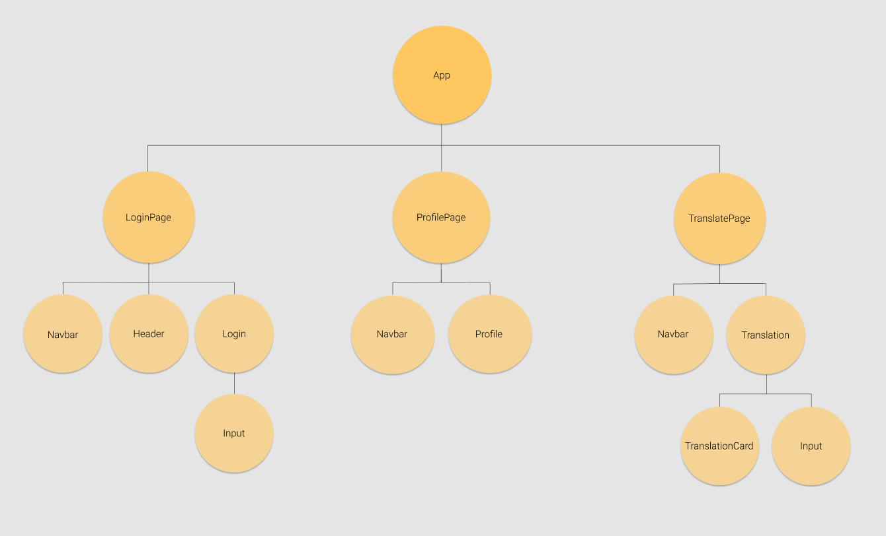

# Lost in Translation

This application was created during Noroff's Accelerated program. It is an application for converting wirtten language into American sign language.

Test the app [here](https://lost-in-translation-app-noroff.herokuapp.com)

## Component Tree

The application is divided into four parts

- Login Page
- Translations Page
- Profile Page
- API

## Login Page

Login page takes an input from a user and tries to log in to our API. If it fails it will register the user and log them in.

The logged in user gets stored in the browser session.

Once a successful login occurs the user is sent to the translation page.

## Translation Page

The translation page takes an input from the user and translates the string into sign language and displays the corresponding images on the screen.

Each translation gets sent to the API and saved, the session is then updated from the API.

## Profile Page

The profile page shows the logged in user as well as their 10 most recent translations.

There is three buttons on the page.

- Clear translations - deletes the translations from the API and the session.
- Translate - takes the user back to the translation page.
- Log out - deletes the session and sends the user to the login page

## API

We used a JSON server to store our data. Click [here](https://noroff-api-oddalm.herokuapp.com/).

In our API we have three HTTP request actions.

- Login (GET) - logs the user in
- Register (POST) - register a new user in the database
- updateTranslations (PATCH) - updates the translations for the logged in user
